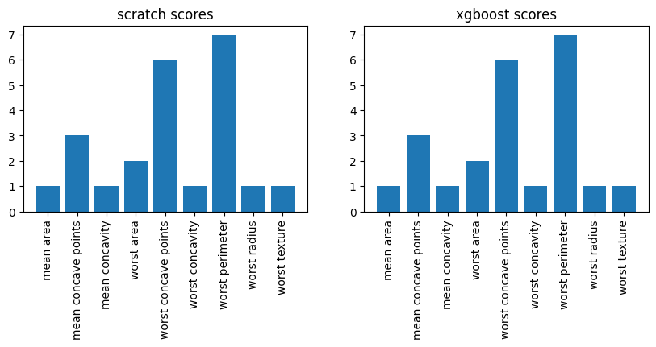

# xgboost-py

xgboost复现，视频讲解见B站：[XGBoost复现](https://www.bilibili.com/video/BV1dc4TezEfR/)

## 训练推理

训练
```
params = {
    'learning_rate': 0.1,
    'max_depth': 5,
    'subsample': 1.0,
    'reg_lambda': 1.5,
    'gamma': 0.0,
    'min_child_weight': 25,
    'base_score': 0.5,
    'tree_method': 'exact',
    'objective': 'binary:logitraw'
}
num_boost_round = 50

model_scratch = XGBoostModel(params, random_seed=42)
model_scratch.fit(X_train, y_train, BinaryCrossEntropybjective(), num_boost_round, verbose=False)
```

推理
```
pred_scratch=model_scratch.predict(X_test)

def accuracy(y_test,pred):
    probs=1/(1+np.exp(-pred))
    classes=np.zeros_like(probs)
    classes[probs>0.5]=1

    # 计算准确率
    acc=(classes==y_test).sum()/len(classes)*100
    # numpy转float 
    return acc.item()

print(f'scratch acc:{accuracy(y_test,pred_scratch)}')
```

scratch acc:94.15204678362574

## 特征重要性

```
# 特征重要性
model_scratch.get_score(importance_type="weight")
```



## 树结构绘制

```
# 画出第5棵树
model_scratch.plot_tree(num_trees=5,feature_names=X.columns)
```


## 参考资料

* 文字：https://www.zhihu.com/question/58883125/answer/2551395292
* 视频：https://www.bilibili.com/video/BV1Zk4y1F7JE/
* 代码：https://randomrealizations.com/posts/xgboost-from-scratch/ 